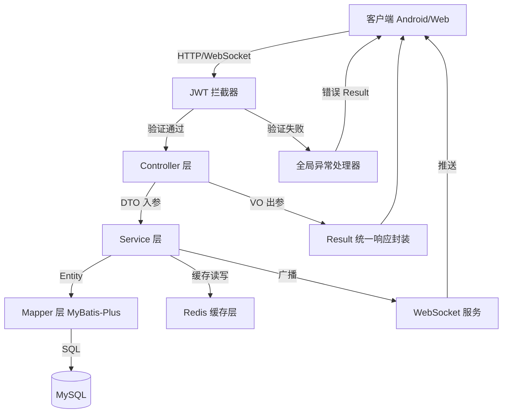
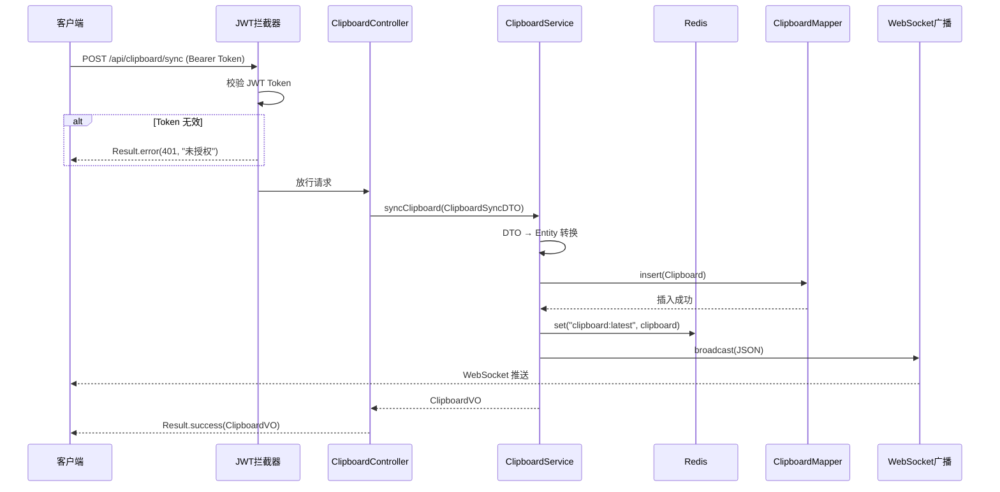
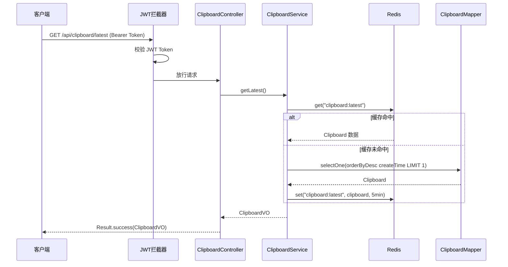
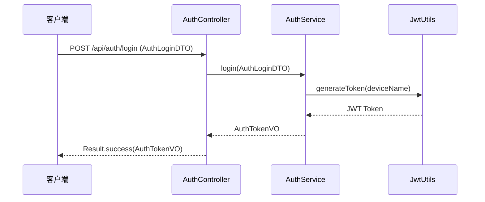

# 设计文档：EchoSync 企业级架构重构

## 概述

EchoSync 是一个基于 Spring Boot 3.5 + MyBatis-Plus + WebSocket + JWT 的跨设备剪贴板同步项目。当前项目存在分层缺失问题：实体类、Controller、Mapper 混杂在同一个包下，缺少统一响应封装、全局异常处理、DTO/VO 分离等企业级基础设施。

本次重构目标：
- 调整为标准企业级分层架构（Controller → Service → Mapper）
- 引入统一响应体 `Result<T>`、全局异常处理器
- DTO/VO 分离、Lombok 简化样板代码
- JWT 拦截器、Redis 缓存层
- 按 features 模块化组织代码
- 每个功能模块配套教程文档，拆分为小步骤

## 架构

### 系统架构图



### 目标包结构（features 分模块）

```
com.ziv.echosync/
├── EchoSyncApplication.java
│
├── common/                              # 公共基础设施模块
│   ├── result/
│   │   ├── Result.java                 # 统一响应体
│   │   └── ResultCode.java            # 响应状态码枚举
│   ├── exception/
│   │   ├── BusinessException.java     # 业务异常
│   │   └── GlobalExceptionHandler.java
│   └── config/
│       ├── RedisConfig.java
│       ├── WebMvcConfig.java          # 注册拦截器
│       └── MyBatisPlusConfig.java
│
├── features/                            # 业务功能模块（按 feature 分包）
│   ├── auth/                           # 认证模块
│   │   ├── AuthController.java
│   │   ├── AuthService.java
│   │   ├── AuthServiceImpl.java
│   │   ├── dto/
│   │   │   └── AuthLoginDTO.java
│   │   ├── vo/
│   │   │   └── AuthTokenVO.java
│   │   └── interceptor/
│   │       └── JwtInterceptor.java
│   │
│   ├── clipboard/                      # 剪贴板模块
│   │   ├── ClipboardController.java
│   │   ├── ClipboardService.java
│   │   ├── ClipboardServiceImpl.java
│   │   ├── ClipboardMapper.java
│   │   ├── entity/
│   │   │   └── Clipboard.java
│   │   ├── dto/
│   │   │   └── ClipboardSyncDTO.java
│   │   └── vo/
│   │       └── ClipboardVO.java
│   │
│   └── websocket/                      # WebSocket 模块
│       ├── EchoWebSocketServer.java
│       └── WebSocketConfig.java
│
└── utils/                               # 工具类
    └── JwtUtils.java
```


## 组件与接口

### 组件 1：统一响应体 Result\<T\>

**职责**：封装所有 API 响应，提供统一的 JSON 结构。

```java
@Data
public class Result<T> {
    private int code;
    private String message;
    private T data;

    public static <T> Result<T> success(T data) { /* ... */ }
    public static <T> Result<T> success() { /* ... */ }
    public static <T> Result<T> error(ResultCode resultCode) { /* ... */ }
    public static <T> Result<T> error(int code, String message) { /* ... */ }
}

@Getter
@AllArgsConstructor
public enum ResultCode {
    SUCCESS(200, "操作成功"),
    BAD_REQUEST(400, "请求参数错误"),
    UNAUTHORIZED(401, "未授权"),
    FORBIDDEN(403, "禁止访问"),
    NOT_FOUND(404, "资源不存在"),
    INTERNAL_ERROR(500, "服务器内部错误");

    private final int code;
    private final String message;
}
```

### 组件 2：全局异常处理器

```java
@RestControllerAdvice
public class GlobalExceptionHandler {
    @ExceptionHandler(BusinessException.class)
    public Result<?> handleBusinessException(BusinessException e) { /* ... */ }

    @ExceptionHandler(MethodArgumentNotValidException.class)
    public Result<?> handleValidationException(MethodArgumentNotValidException e) { /* ... */ }

    @ExceptionHandler(Exception.class)
    public Result<?> handleException(Exception e) { /* ... */ }
}
```

### 组件 3：JWT 拦截器

```java
public class JwtInterceptor implements HandlerInterceptor {
    @Override
    public boolean preHandle(HttpServletRequest request,
                             HttpServletResponse response,
                             Object handler) throws Exception {
        // 1. 从 Header 中提取 Authorization: Bearer <token>
        // 2. 调用 JwtUtils.parseToken() 校验
        // 3. 校验失败抛出 BusinessException(UNAUTHORIZED)
        // 4. 校验成功将设备名存入 request attribute
    }
}
```

### 组件 4：Redis 缓存层

**缓存策略**：
- `clipboard:latest` — 缓存最新一条剪贴板记录
- sync 时更新缓存，getLatest 时优先读缓存
- TTL：5 分钟自动过期

## 数据模型

### Entity：Clipboard（使用 Lombok）

```java
@Data
@TableName("clipboard")
public class Clipboard {
    @TableId(type = IdType.AUTO)
    private Long id;
    private String content;
    private String deviceName;
    private LocalDateTime createTime;
}
```

### DTO：ClipboardSyncDTO

```java
@Data
public class ClipboardSyncDTO {
    @NotBlank(message = "内容不能为空")
    private String content;
    @NotBlank(message = "设备名不能为空")
    private String deviceName;
}
```

### DTO：AuthLoginDTO

```java
@Data
public class AuthLoginDTO {
    @NotBlank(message = "设备名不能为空")
    private String deviceName;
}
```

### VO：ClipboardVO

```java
@Data
public class ClipboardVO {
    private Long id;
    private String content;
    private String deviceName;
    private LocalDateTime createTime;
}
```

### VO：AuthTokenVO

```java
@Data
public class AuthTokenVO {
    private String token;
    private String deviceName;
}
```

## 时序图

### 剪贴板同步流程



### 获取最新剪贴板流程



### 设备登录流程



## 关键函数与形式化规约

### ClipboardServiceImpl.syncClipboard

```java
@Override
public ClipboardVO syncClipboard(ClipboardSyncDTO dto) {
    Clipboard clipboard = new Clipboard();
    clipboard.setContent(dto.getContent());
    clipboard.setDeviceName(dto.getDeviceName());
    clipboard.setCreateTime(LocalDateTime.now());
    clipboardMapper.insert(clipboard);
    redisTemplate.opsForValue().set(CACHE_KEY, clipboard, 5, TimeUnit.MINUTES);
    String json = objectMapper.writeValueAsString(clipboard);
    EchoWebSocketServer.broadcast(json);
    return toVO(clipboard);
}
```

**前置条件**：dto 非 null，content/deviceName 非空白
**后置条件**：数据库新增记录、Redis 缓存已更新、WebSocket 已广播、返回完整 VO

### ClipboardServiceImpl.getLatest

```java
@Override
public ClipboardVO getLatest() {
    Clipboard cached = (Clipboard) redisTemplate.opsForValue().get(CACHE_KEY);
    if (cached != null) return toVO(cached);
    QueryWrapper<Clipboard> qw = new QueryWrapper<>();
    qw.orderByDesc("create_time").last("LIMIT 1");
    Clipboard clipboard = clipboardMapper.selectOne(qw);
    if (clipboard != null) {
        redisTemplate.opsForValue().set(CACHE_KEY, clipboard, 5, TimeUnit.MINUTES);
    }
    return clipboard != null ? toVO(clipboard) : null;
}
```

**前置条件**：Redis/MySQL 连接可用
**后置条件**：优先返回缓存，缓存未命中则查库并回填

### JwtInterceptor.preHandle

**前置条件**：请求路径不在白名单中
**后置条件**：Token 有效则放行并存入 deviceName；无效则抛 BusinessException(UNAUTHORIZED)

## Correctness Properties

*属性是指在系统所有有效执行中都应成立的特征或行为——本质上是对系统应做什么的形式化陈述。属性是人类可读规范与机器可验证正确性保证之间的桥梁。*

### Property 1: Result 工厂方法正确性

*For any* 业务数据 T，调用 Result.success(data) 应返回 code=200、message="操作成功"、data 等于传入数据；*For any* ResultCode，调用 Result.error(resultCode) 应返回对应的 code 和 message，且 data 为 null。

**Validates: Requirements 1.1, 1.2, 1.3**

### Property 2: 异常处理映射正确性

*For any* ResultCode rc，当 GlobalExceptionHandler 处理携带 rc 的 BusinessException 时，返回的 Result 的 code 应等于 rc.getCode()，message 应等于 rc.getMessage()；*For any* 未预期 Exception，返回的 Result 的 code 应为 500。

**Validates: Requirements 2.1, 2.3**

### Property 3: DTO 空白字段校验

*For any* 纯空白字符串（包括空字符串、空格、制表符等），当该字符串作为 ClipboardSyncDTO 的 content 或 deviceName，或 AuthLoginDTO 的 deviceName 提交时，系统应返回 code=400 的校验失败响应，且原始数据不受影响。

**Validates: Requirements 3.3, 3.4, 3.5**

### Property 4: DTO → Entity → VO 字段一致性

*For any* 有效的 ClipboardSyncDTO，经过 Service 层转换为 Entity 再转换为 ClipboardVO 后，content 和 deviceName 字段的值应与原始 DTO 保持一致。

**Validates: Requirement 3.7**

### Property 5: JWT 拦截器对无效请求的拒绝

*For any* 非白名单路径的请求，当请求头缺少 Authorization 字段或携带无效/过期的 JWT Token 时，JWT_拦截器应抛出 BusinessException(UNAUTHORIZED)。

**Validates: Requirements 4.1, 4.2**

### Property 6: JWT Token 生成与解析 round-trip

*For any* 合法设备名字符串 deviceName，调用 JwtUtils.generateToken(deviceName) 生成 Token 后，再调用 JwtUtils.parseToken(token) 解析，应返回与原始 deviceName 相同的字符串。

**Validates: Requirements 4.3, 4.5**

### Property 7: 剪贴板同步操作完整性

*For any* 有效的 ClipboardSyncDTO，调用 syncClipboard 后，数据库应新增一条对应记录，Redis 缓存键 clipboard:latest 应包含该记录，且所有在线 WebSocket 会话应收到该记录的 JSON 广播。

**Validates: Requirements 5.1, 5.2, 5.3**

### Property 8: 登录流程返回有效 Token

*For any* 有效的 AuthLoginDTO（deviceName 非空白），调用登录接口后返回的 AuthTokenVO 应包含非空的 token 字段和与请求一致的 deviceName 字段，且该 token 可被 JwtUtils.parseToken 成功解析。

**Validates: Requirements 6.1, 6.2**

### Property 9: WebSocket 广播容错性

*For any* 在线会话集合，当其中某个会话发送消息抛出 IOException 时，广播操作应跳过该会话并继续向其余会话成功发送消息。

**Validates: Requirement 8.2**

## 错误处理

| 场景 | 条件 | 响应 | 恢复 |
|------|------|------|------|
| JWT 缺失/无效 | 无 Authorization 或 Token 过期 | Result.error(401) | 重新登录获取 Token |
| 参数校验失败 | DTO 字段不满足校验 | Result.error(400, 具体提示) | 修正参数重试 |
| Redis 异常 | Redis 不可用 | 降级查数据库 | Redis 恢复后自动重连 |
| WebSocket 异常 | 某会话发送失败 | 跳过该会话继续广播 | 异常会话自动清理 |
| 数据库异常 | MySQL 连接失败 | Result.error(500) | 连接池自动重连 |

## 依赖

### 新增 Maven 依赖

| 依赖 | 用途 |
|------|------|
| `spring-boot-starter-data-redis` | Redis 缓存支持 |
| `spring-boot-starter-validation` | DTO 参数校验 |
| `lombok` | 消除 getter/setter/构造器样板代码 |

### 现有依赖（保持不变）

| 依赖 | 用途 |
|------|------|
| `spring-boot-starter-web` | Web MVC |
| `spring-boot-starter-websocket` | WebSocket |
| `mybatis-plus-spring-boot3-starter` | MyBatis-Plus ORM |
| `mysql-connector-j` | MySQL 驱动 |
| `jjwt-api/impl/jackson` | JWT 处理 |

## 教程文档规划

每个功能模块将配套一份教程文档（放在项目根目录 `docs/` 下），按小步骤拆分：

| 教程文档 | 对应模块 | 内容 |
|----------|----------|------|
| `docs/01-common-基础设施搭建.md` | common/ | Lombok 配置、Result、ResultCode、BusinessException、GlobalExceptionHandler |
| `docs/02-auth-认证模块.md` | features/auth/ | AuthLoginDTO、AuthTokenVO、AuthService、AuthController、JwtInterceptor、WebMvcConfig |
| `docs/03-clipboard-剪贴板模块.md` | features/clipboard/ | Entity、DTO、VO、Mapper、Service（含 Redis 缓存）、Controller |
| `docs/04-websocket-实时推送模块.md` | features/websocket/ | WebSocket 配置、EchoWebSocketServer |
| `docs/05-redis-缓存配置.md` | common/config/ | RedisConfig、application.properties Redis 配置 |
